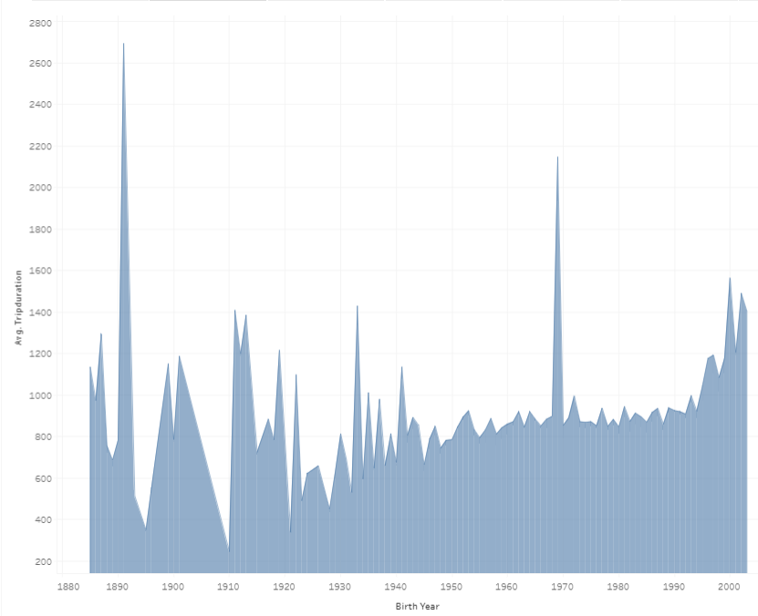
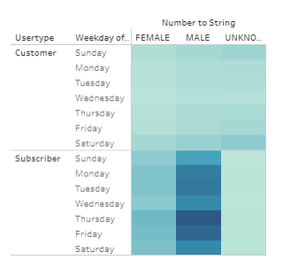
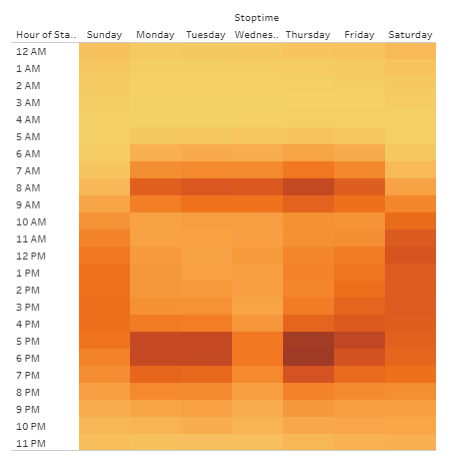
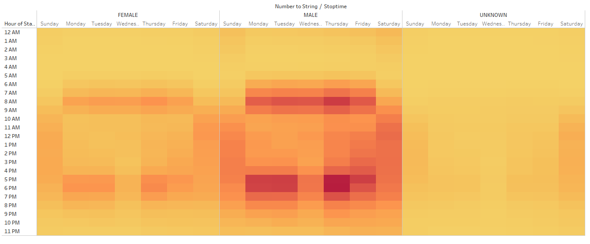
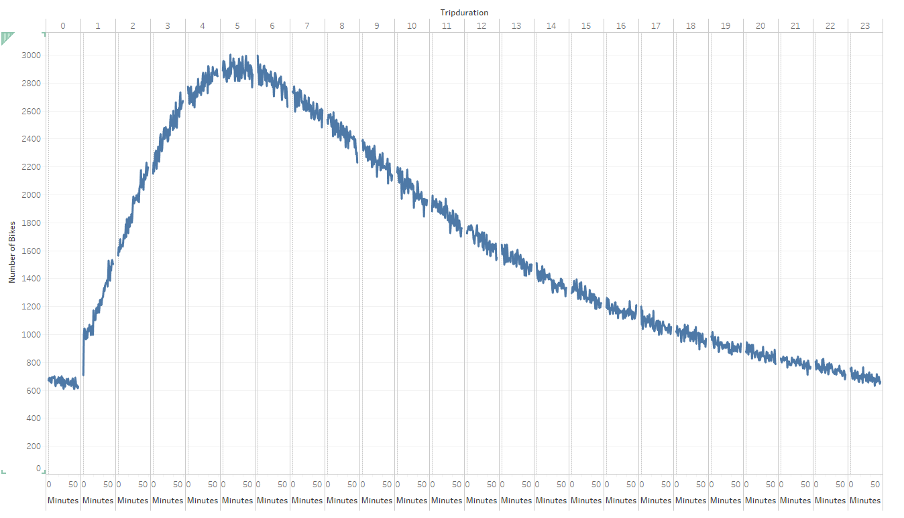
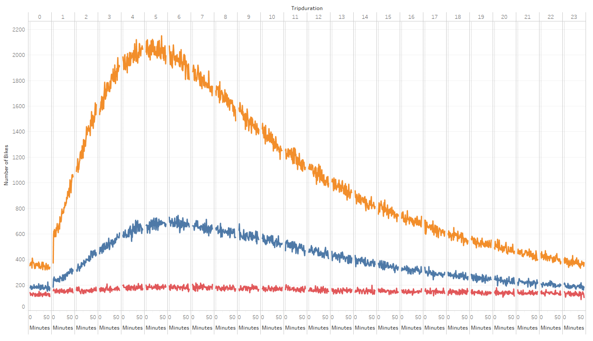

# Des Moines CitiBike

## Project Overview

The purpose of this analysis is to:
-	Provide an analysis of NYC market data from a bike-sharing program to evaluate and forecast viability in Des Moines, Iowa
-	Presented NYC CitiBike data on Tableau to convince investors how the model will work in Des Moines

## Results

The [Des Moines CitiBike Proposal]( https://public.tableau.com/shared/3YS63Z52H?:display_count=y&:origin=viz_share_link):

-	Looking at subscribers versus customers, there are roughly 3 times more subscribers.

-	The average trip duration is longer with younger users.

-	Male and female customers use the bikes mostly on weekends.  Male and female subscribers use the bikes mostly on Thursday and Friday.  Male subscribers use the bikes the most.

-	Weekly usage of the bike has high hours between 6-9am and 4-7pm.  Weekend usage is consistent from 10-5pm.

-	Weekly usage by gender follows the same trend as the last heat map.  Males and females have the most usage on Thursdays from 5-6pm.

-	Bikes were kept between 4-6 hours, with many bikes kept upwards of 15 hours.

-	Males have a similar trend to the last graph.  Females kept the bikes for 4-9 hours with some keeping the bikes upwards of 16 hours.

## Summary

-	To start a bike-sharing program in Des Moines, target customers would need to on the younger side. Programs that benefit low use times, subscribers, and that draws in new customers and more female users would benefit the program.  

-	Another visualization that should be created is a map showing the most used start and end stations.  This would serve in choosing station placements around Des Moines.  Checking the locations in relation to parks, museums, bars, etc. would suit in choosing primary locations.

-	A visualization showing a map with locations with the longest trip durations will help with deciding what locations may need more bikes.  This can also show locations that should be checked more often for repairs.

## Resources
- Data Source: NYC_CitiBike.csv
- Software: Tableau Public 2020.3, Jupyter Notebook, Pandas, Python
